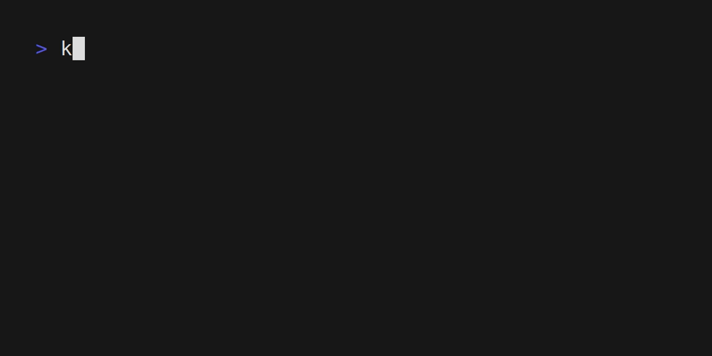

# Helm Demo

## Prerequisites

- Kubernetes cluster
- [brew](https://docs.brew.sh/Homebrew-on-Linux)

## Helm installation

```bash
brew install helm
```

## Create New Project

```bash
helm create helm-demo
cd helm-demo
```

## Modify values.yaml and templates/service.yaml

values.yaml

```yaml
image:
  repository: docker.io/meirongdev/hello-node
  pullPolicy: IfNotPresent
  # Overrides the image tag whose default is the chart appVersion.
  tag: "v0.0.1"
  containerPort: 3000
```

templates/service.yaml

```diff
spec:
  type: {{ .Values.service.type }}
  ports:
    - port: {{ .Values.service.port }}
-     targetPort: http
+     targetPort: {{ .Values.image.containerPort }}
      protocol: TCP
      name: http
```

Can check the result of the template rendering by running the following command:

```bash
helm template .
```

## Install Chart

```bash
helm install helm-demo .
```

Check the result

```bash
helm ls

kubectl get svc -o wide   
```


## Upgrade Chart

change the port to 80 in `values.yaml`

```diff
service:
  type: ClusterIP
- port: 80
+ port: 3000
```

```bash
helm upgrade helm-demo .
```

Check the result

```bash
kubectl get svc -o wide
```




## Uninstall Chart

```bash
helm uninstall helm-demo
```